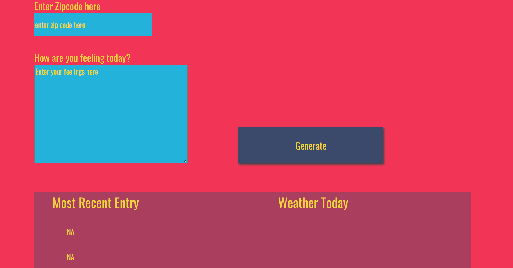
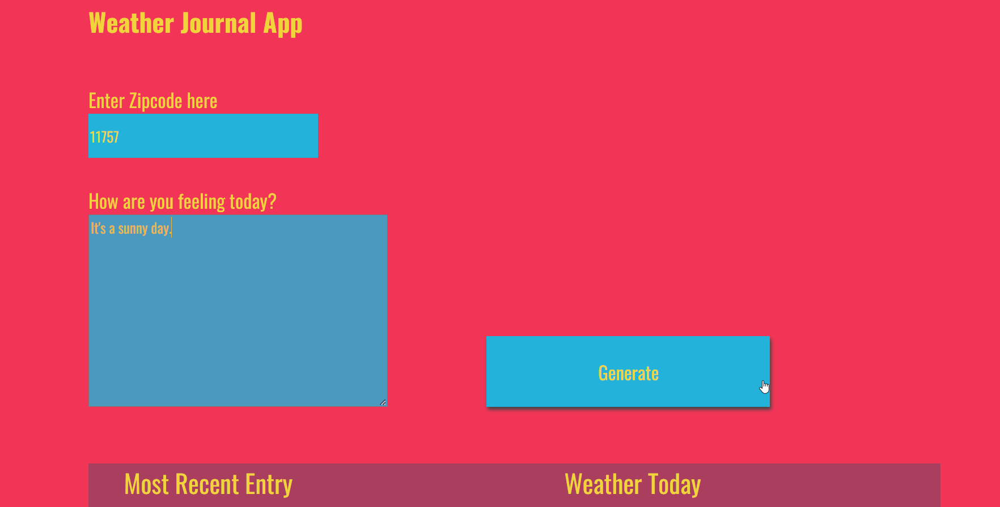
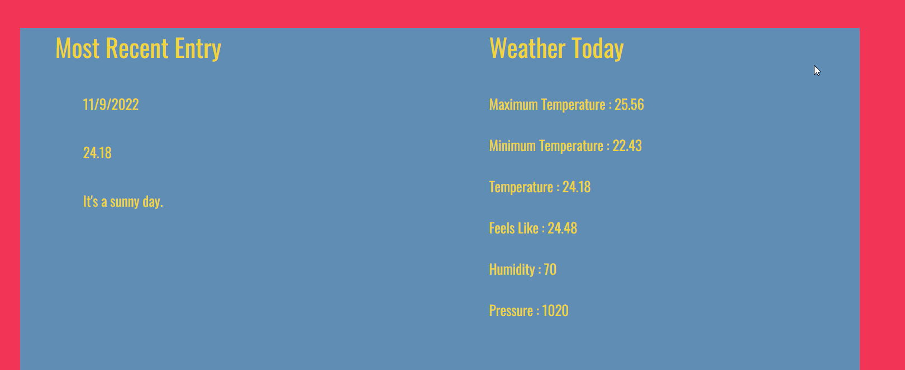
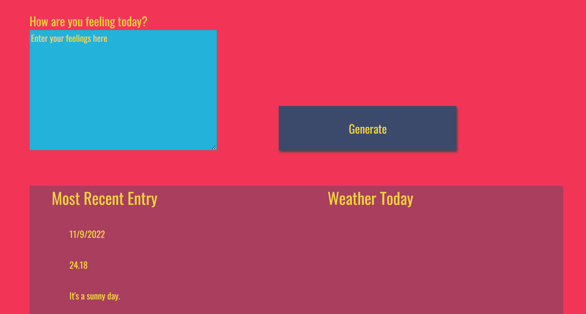
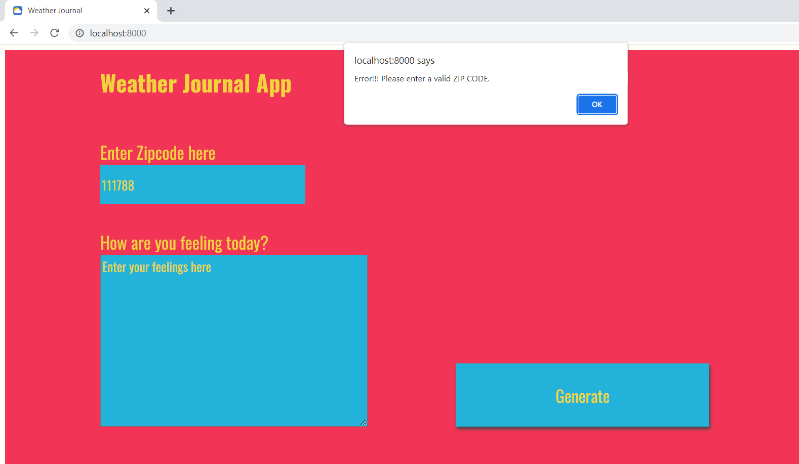

# Weather-Journal App Project

## Overview

### This project uses Web API and user data to dynamically update the UI. It takes input from the user:

1. Zip Code for location.
2. How is the user feeling that day.

It then uses **Zip Code** to do an inquiry to the Wep API and get back the Temperature.
It then sends data that will be saved on the local server App Endpoint:

* **Date**, at which the inquiry was done.
* **Temperature** at this day.
* The **feeling** of the user this day.

And finally it uses the data to update the UI, specifically the **"Most Recent Entry"** section.

## Note: You will need to add your Own API Key in `website/app.js`. To get an API Key head to `https://openweathermap.org/api`.

## My Strategy to build the App:

I divided the app into several tasks, and worked on each task seperately.

I used git, building the app, so each task is built on a seperate branch, simulating a team work enviroment.

**Task List**

1. Installing the dependencies and setting up the server.
    
2. Acquiring API Key from OpenWeatherMap.com

3. Setting up Get Route and Post Route

4. Integrating OpenWeatherMap API

5. Adjusting UI

6. Dynamically Update UI

## How the App works

* First, using **npm package manager** to install **express**, **cors** and **body-parser**, and running the server on port 8000.

* The user enters, his **Zip Code** signifying his location and and how he is **feeling** on this day. (note: zip code isn't supported by all countries, and Egypt is one of the countries that doesn't support it, so the project is available mainly for USA zip codes.)

* Then the app uses the enterd **Zip Code** to forge an inquiry link for the **Geocode API** on OpenWeatherMap.com. This inquiry returns the **latitude** and **longitude** of that place.

* Using the **latitude** and **longitude**, the app forges a new inquiry link, for the **Weather API** on OpenWeatherMap.com. This returns the **Weather Data** needed by the app.

* A chain of promises takes place: 
            
             1. GET request to the **Geocode API**.
             2. GET request to the **Weather API**.
             3. POST request to the **Local Server (App API Endpoint)**.
             4. GET request to the **LocalServer**.

* The **Date**, **Temperature** and **Feelings** is sent to the local server to be stored in the endpoint.

* A final GET request is made, and the data coming from the API Endpoint is displayed on the UI for the user. It's displayed under **Most Recent Entry**. While the data coming from OpenWeatherMap.com is displayed under **Weather Today**.

* Whenever the app starts, it requests the App Endpoint data, and displays them, if there's no data yet, it displays **NA** instead.

## Screenshots of the App running

The App when it first starts:

Generating an API Inquiry:

UI has been updated:

Journal Data is still kept  after refreshing the page:

Alert in case of invalid Zip Code:

